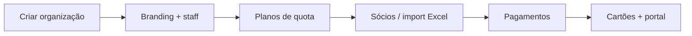

# Como adicionar um clube novo

Guia operacional para o **Imperador** criar e pôr a funcionar uma nova organização (tenant) no ClubOS.

## Pré-requisitos

- Conta com papel **imperador** na plataforma
- Ambiente com API + Web a correr (local ou produção)
- SMTP configurado se fores convidar staff por email

## Fluxo (ordem recomendada)

### 1. Criar a organização

1. Entrar no backoffice como imperador
2. Ir a **Módulos** → **Novo clube**
3. Indicar o **nome** (obrigatório) e **slug** opcional (ex.: `crc-vale`)
4. Confirmar — o sistema:
   - cria o tenant (`Organization`)
   - activa módulos base: dashboard, members, membership-plans, payments
   - associa-te como imperador dessa org
   - define-a como **organização activa** e redirecciona para o dashboard

API equivalente: `POST /api/organizations` com `{ "name": "...", "slug": "..." }`.

### 2. Branding e staff

Em **Definições** (`/settings`):

- Logótipo e cor primária (portal e cartões)
- Convidar **administrador** / **tesoureiro** (membership por org)

Só o staff convidado vê dados desta org (isolamento multi-tenant).

### 3. Planos de quota

Em **Planos** (`/membership-plans`): criar pelo menos um plano com nome exacto que vais usar no Excel (ex.: `Quota social — mensal`).

O import resolve o plano pelo **nome** (comparação pt, ignora acentos).

### 4. Sócios

Em **Membros** (`/members`):

- Criar manualmente, **ou**
- Importar Excel: **sempre dry-run primeiro** → corrigir erros → import real

Ver [Import Excel — erros comuns](IMPORT-EXCEL-ERROS.md).

### 5. Pagamentos e resto

- Registar pagamentos em **Pagamentos** (ou via colunas de pagamento no Excel)
- Activar módulos extra em **Módulos** (cartões, comunicações, …)
- Em **Cartões**: escolher template (ex. CRC Vale) e gerar cartões
- Em Membros: **conceder acesso ao portal** aos sócios com email

## Checklist rápida

| Passo                            | Onde                 | Feito |
| -------------------------------- | -------------------- | ----- |
| Org criada e activa              | Módulos → Novo clube | ☐     |
| Logo / cor                       | Definições           | ☐     |
| Admin / tesoureiro               | Definições           | ☐     |
| ≥ 1 plano de quota               | Planos               | ☐     |
| Sócios importados / criados      | Membros              | ☐     |
| 1.º pagamento de teste           | Pagamentos           | ☐     |
| Cartões / portal (se necessário) | Cartões / Membros    | ☐     |

## Notas

- O checklist **Primeiros passos** no dashboard segue esta ordem (passos Imperador só visíveis para imperador).
- Para o piloto CRC Vale, ver também [Go-live CRC Vale](GO-LIVE-CRC-VALE.md).
- Não mistures orgs: confirma o selector de organização no header antes de importar dados.
