# Atores e casos de uso

## Diagramas visuais (UML clássico)


Fontes: [`plantuml/uc-*.puml`](plantuml/) · regenerar: `pwsh docs/analise/render-diagrams.ps1`

## 1. Diagrama de casos de uso (Mermaid — mapa editável)

```mermaid
flowchart TB
  subgraph actores[" "]
    Imp((Imperador))
    Adm((Administrador))
    Tes((Tesoureiro))
    Soc((Sócio))
    Vis((Visitante))
    Sis((Sistema))
  end

  subgraph auth["Autenticação"]
    UC01[UC01 Autenticar-se]
    UC02[UC02 Recuperar password]
    UC03[UC03 Gerir passkeys]
  end

  subgraph platform["Plataforma / multi-tenant"]
    UC10[UC10 Trocar org activa]
    UC11[UC11 Criar organização]
    UC12[UC12 Activar módulos]
    UC13[UC13 Convidar staff]
  end

  subgraph members["Sócios e quotas"]
    UC20[UC20 Gerir sócios]
    UC21[UC21 Importar Excel]
    UC22[UC22 Exportar / RGPD]
    UC23[UC23 Gerir planos de quota]
  end

  subgraph finance["Financeiro"]
    UC30[UC30 Registar pagamento]
    UC31[UC31 Emitir recibo PDF]
    UC32[UC32 Consultar relatórios]
  end

  subgraph cards["Cartões"]
    UC40[UC40 Gerar / imprimir cartões]
    UC41[UC41 Validar QR público]
  end

  subgraph portal["Portal"]
    UC50[UC50 Conceder acesso portal]
    UC51[UC51 Consultar quotas e cartão]
    UC52[UC52 Descarregar recibos]
  end

  subgraph ops["Operações"]
    UC60[UC60 Enviar comunicações]
    UC61[UC61 Consultar auditoria]
    UC62[UC62 Configurar clube]
    UC63[UC63 Enviar lembretes quota]
  end

  Imp --> UC01 & UC02 & UC03
  Imp --> UC10 & UC11 & UC12 & UC13
  Imp --> UC20 & UC21 & UC22 & UC23
  Imp --> UC30 & UC31 & UC32
  Imp --> UC40 & UC60 & UC61 & UC62

  Adm --> UC01 & UC02 & UC03
  Adm --> UC10
  Adm --> UC13 & UC20 & UC21 & UC22 & UC23
  Adm --> UC30 & UC31 & UC32
  Adm --> UC40 & UC50 & UC60 & UC61 & UC62

  Tes --> UC01 & UC02
  Tes --> UC10
  Tes --> UC20
  Tes --> UC30 & UC31 & UC32

  Soc --> UC01 & UC02 & UC03
  Soc --> UC51 & UC52

  Vis --> UC41
  Sis --> UC31 & UC63
```



> Mermaid não tem notação UML “elipse” nativa; o diagrama acima é o mapa de UC por actor. Para o relatório formal, podes reexportar as elipses no draw.io / PlantUML a partir desta lista.

## 2. Catálogo de casos de uso

### Autenticação

| ID   | Caso de uso                               | Actor primário | Prioridade | Estado |
| ---- | ----------------------------------------- | -------------- | ---------- | ------ |
| UC01 | Autenticar-se (email/password ou passkey) | Staff, Sócio   | Alta       | ✅     |
| UC02 | Recuperar / redefinir password            | Utilizador     | Alta       | ✅     |
| UC03 | Gerir passkeys na conta                   | Staff, Sócio   | Média      | ✅     |

### Plataforma

| ID   | Caso de uso                  | Actor primário  | Prioridade | Estado |
| ---- | ---------------------------- | --------------- | ---------- | ------ |
| UC10 | Trocar organização activa    | Staff multi-org | Alta       | ✅     |
| UC11 | Criar organização            | Imperador       | Alta       | ✅     |
| UC12 | Activar / desactivar módulos | Imperador       | Alta       | ✅     |
| UC13 | Convidar / gerir staff       | Admin+          | Alta       | ✅     |

### Sócios e quotas

| ID   | Caso de uso                          | Actor primário          | Prioridade | Estado |
| ---- | ------------------------------------ | ----------------------- | ---------- | ------ |
| UC20 | CRUD de sócios + foto                | Admin+ (leitura: staff) | Alta       | ✅     |
| UC21 | Importar sócios (Excel, dry-run)     | Admin+                  | Alta       | ✅     |
| UC22 | Exportar Excel / export + erase RGPD | Admin+                  | Alta       | ✅     |
| UC23 | Gerir planos de quota                | Admin+                  | Alta       | ✅     |

### Financeiro e cartões

| ID   | Caso de uso                            | Actor primário  | Prioridade | Estado |
| ---- | -------------------------------------- | --------------- | ---------- | ------ |
| UC30 | Registar pagamento de quota            | Staff           | Alta       | ✅     |
| UC31 | Emitir recibo PDF (fila)               | Staff / Sistema | Alta       | ✅     |
| UC32 | Relatórios (overview, atraso, CSV/PDF) | Staff           | Alta       | ✅     |
| UC40 | Gerar / exportar cartões (PNG/PDF)     | Admin+          | Alta       | ✅     |
| UC41 | Validar cartão por QR                  | Visitante       | Alta       | ✅     |

### Portal e operações

| ID   | Caso de uso                             | Actor primário | Prioridade | Estado |
| ---- | --------------------------------------- | -------------- | ---------- | ------ |
| UC50 | Conceder acesso ao portal               | Admin+         | Alta       | ✅     |
| UC51 | Consultar quotas e cartão               | Sócio          | Alta       | ✅     |
| UC52 | Descarregar recibos                     | Sócio          | Alta       | ✅     |
| UC60 | Comunicações email / WhatsApp           | Admin+         | Média      | ✅     |
| UC61 | Consultar auditoria                     | Admin+         | Média      | ✅     |
| UC62 | Configurar clube (nome, logo, settings) | Admin+         | Alta       | ✅     |
| UC63 | Lembretes automáticos de quota          | Sistema        | Alta       | ✅     |

### Futuro (inputs típicos ainda não no menu)

| ID   | Caso de uso                           | Notas            |
| ---- | ------------------------------------- | ---------------- |
| UC70 | Gerir eventos                         | Módulo futuro    |
| UC71 | Repositório de documentos             | Módulo futuro    |
| UC72 | Plugin modalidade (futebol, padel, …) | Só catálogo seed |

## 3. Matriz actor × permissão (resumo)

| Capacidade                      | Imperador | Administrador | Tesoureiro | Sócio |
| ------------------------------- | --------- | ------------- | ---------- | ----- |
| Multi-org / módulos             | ✅        | —             | —          | —     |
| Settings / audit / portal grant | ✅        | ✅            | —          | —     |
| CRUD sócios / import            | ✅        | ✅            | leitura    | —     |
| Pagamentos / relatórios         | ✅        | ✅            | ✅         | —     |
| Cartões / comunicações          | ✅        | ✅            | —          | —     |
| Portal próprio                  | —         | —             | —          | ✅    |

Detalhe de guards: [AUTENTICACAO-RBAC](../AUTENTICACAO-RBAC.md) · [ADR 002](../adr/002-effective-role-por-org.md).

## 4. Modelo de um UC (template académico)

Usa este template por UC no relatório formal:

```text
UC30 — Registar pagamento
Actor primário: Tesoureiro / Administrador
Pré-condições: autenticado; org activa; módulo payments activo; sócio existe
Fluxo principal:
  1. Actor abre Pagamentos
  2. Selecciona sócio e valor/plano
  3. Sistema valida e persiste Payment (organizationId)
  4. Sistema enfileira emissão de recibo (opcional)
  5. Sistema regista AuditLog
Fluxos alternativos: sócio inexistente; módulo desactivado; sem permissão (403)
Pós-condições: pagamento registado; situação de quota actualizada
```
