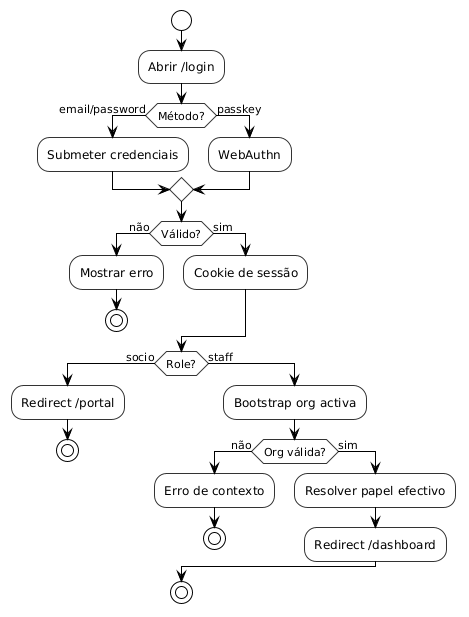
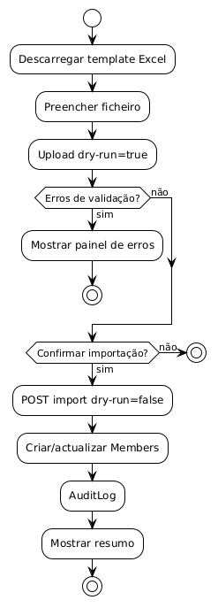
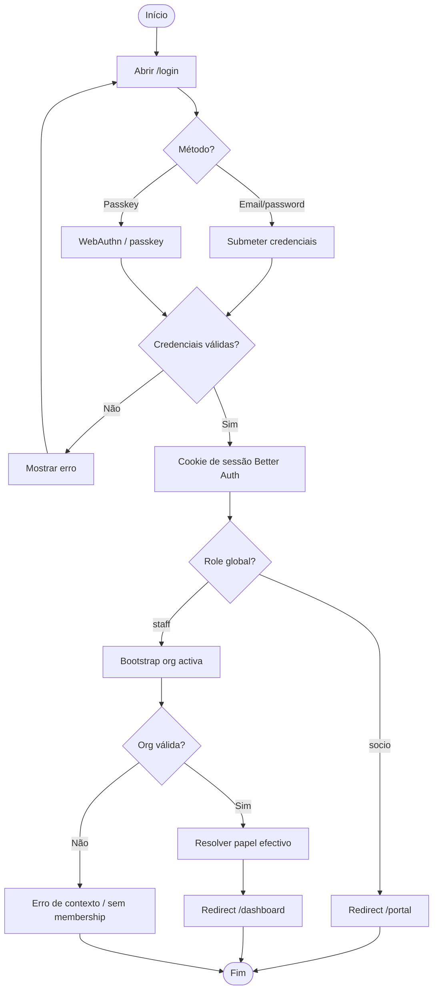
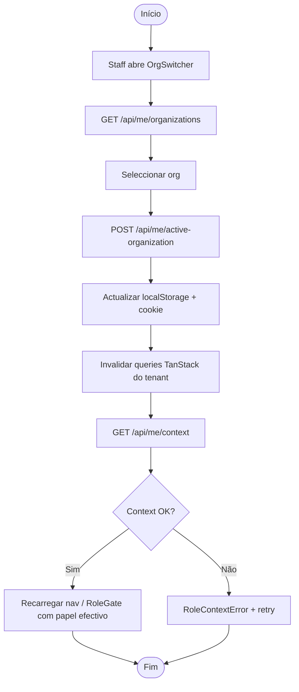
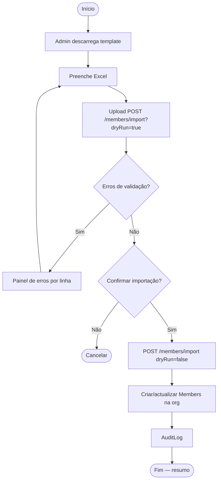
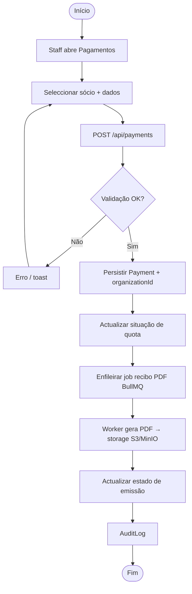
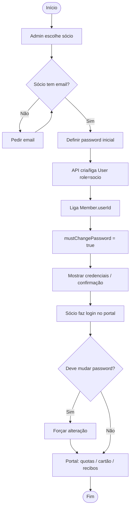
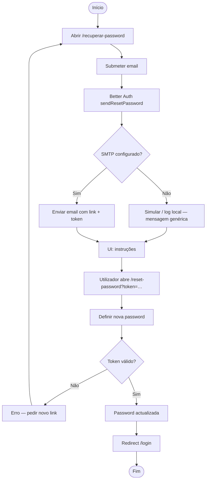
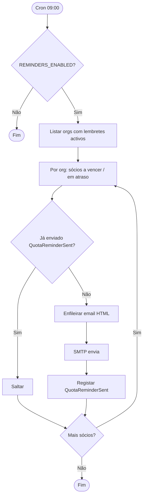
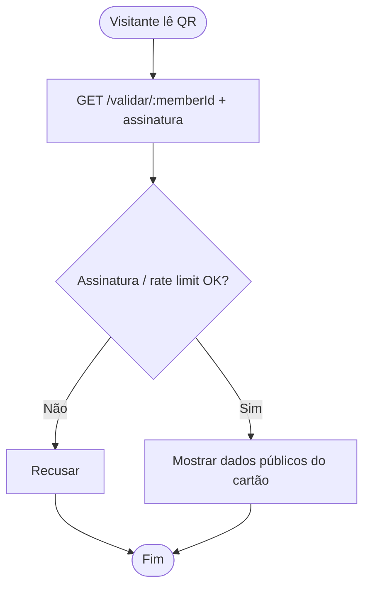

# Diagramas de actividade

Versão visual UML (PlantUML):

Abaixo: mesma lógica em Mermaid (fácil de editar no GitHub).

## AD01 — Autenticação e encaminhamento pós-login

## AD02 — Trocar organização activa (multi-org)

## AD03 — Importar sócios (Excel com dry-run)

## AD04 — Registar pagamento e recibo

## AD05 — Conceder acesso ao portal do sócio

## AD06 — Recuperar password

## AD07 — Lembretes diários de quota (Sistema)

## AD08 — Validar cartão (QR público)

