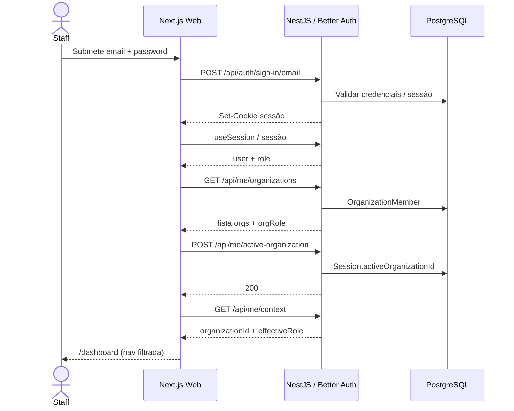
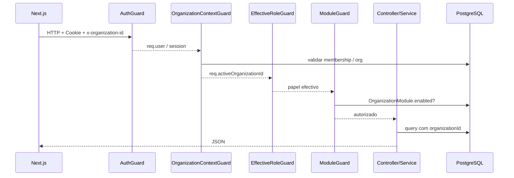
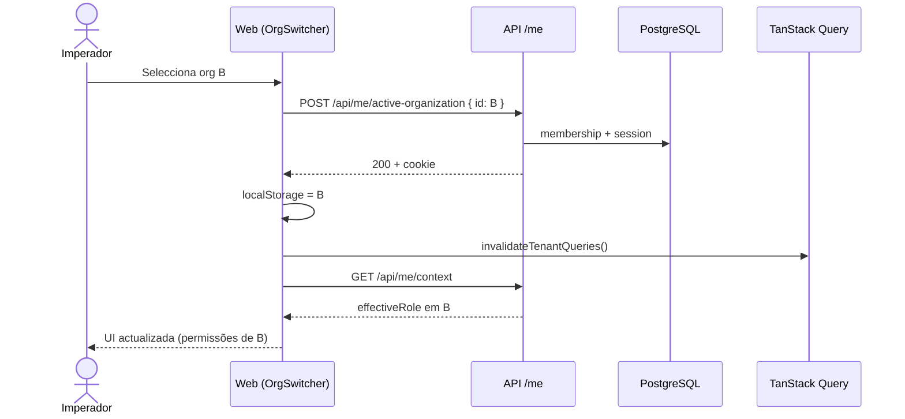
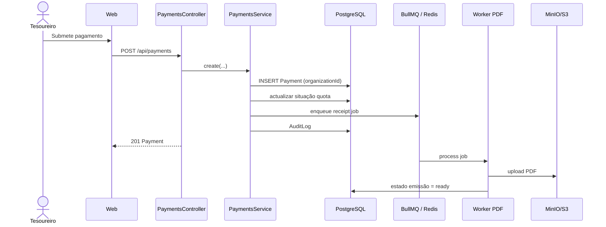
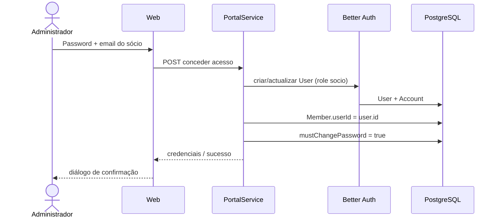
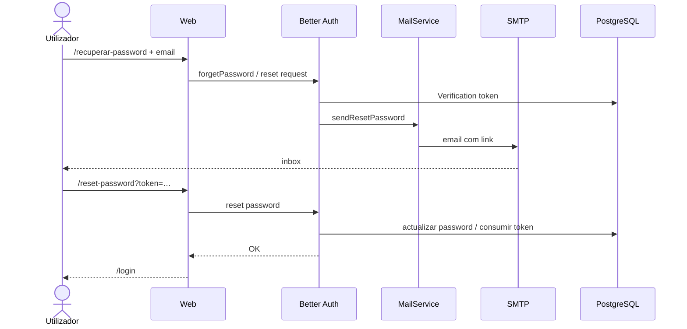
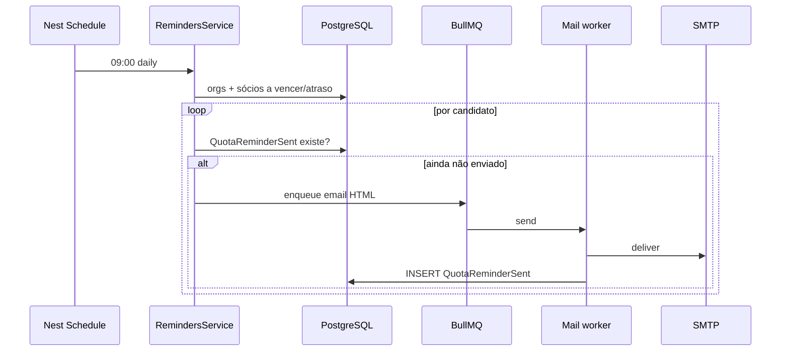
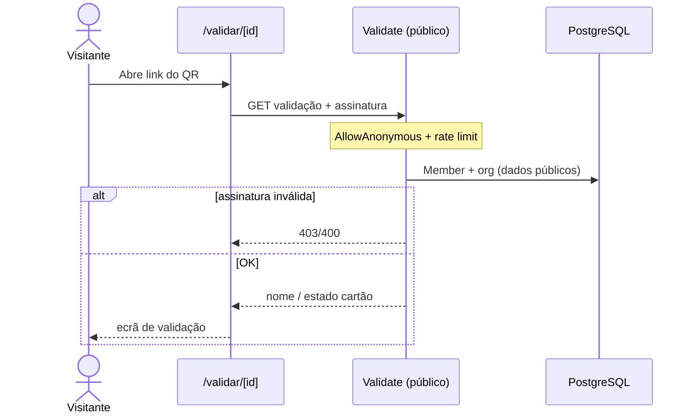

# Diagramas de sequência

Versão visual UML (PlantUML):

Abaixo: mesmas e outras sequências em Mermaid.

## SQ01 — Login staff (email/password)

## SQ02 — Pedido autenticado com tenant (padrão)

## SQ03 — Trocar organização activa

## SQ04 — Registar pagamento + recibo PDF

## SQ05 — Conceder acesso portal

## SQ06 — Recuperar password

## SQ07 — Lembrete de quota (cron)

## SQ08 — Validar QR do cartão

## Notas para o relatório

- Os guards globais (SQ02) são a peça central de segurança multi-tenant — citar [ARQUITETURA](../ARQUITETURA.md).
- O papel efectivo (SQ01/SQ03) não é o `user.role` global — citar [ADR 002](../adr/002-effective-role-por-org.md).
- Para notação UML “pura” (lifelines Enterprise Architect / StarUML), estes Mermaid servem de especificação de origem.
