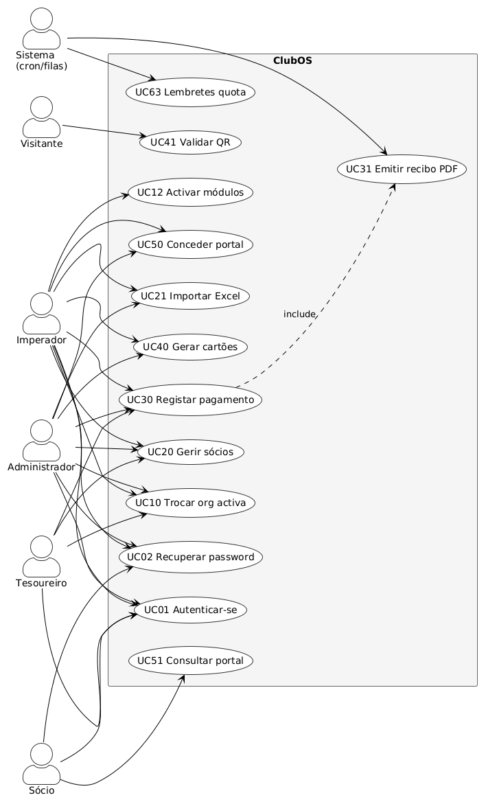
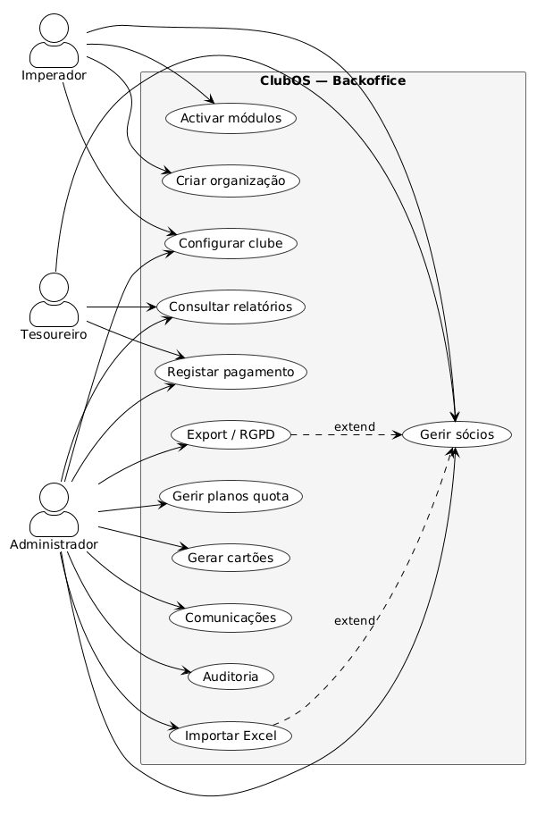
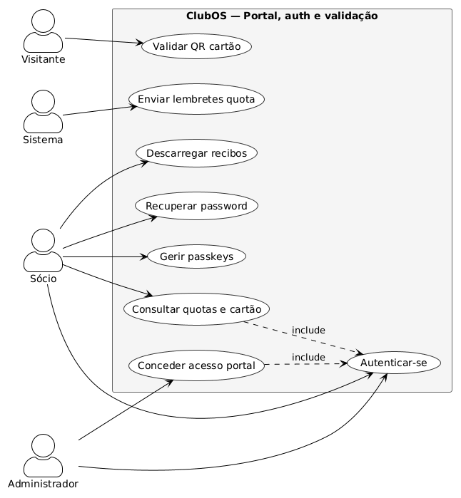
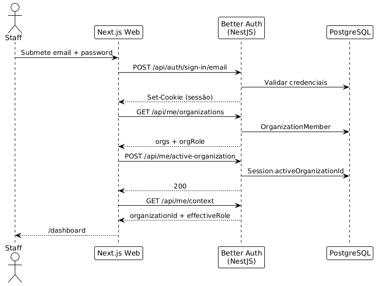
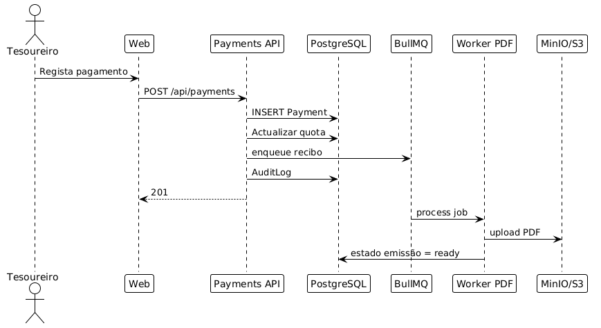

# Análise funcional e UML — ClubOS

Pacote de diagramas de análise alinhado com o MVP actual (piloto CRC Vale).

## Ver os diagramas (imagens)

As figuras abaixo são **UML clássico** (PlantUML → PNG), no estilo actores + ovais + fronteira do sistema.

| Diagrama                       | Imagem                                            |
| ------------------------------ | ------------------------------------------------- |
| Casos de uso — visão geral     | [uc-visao-geral.png](diagrams/uc-visao-geral.png) |
| Casos de uso — backoffice      | [uc-backoffice.png](diagrams/uc-backoffice.png)   |
| Casos de uso — portal / auth   | [uc-portal-auth.png](diagrams/uc-portal-auth.png) |
| Sequência — login staff        | [seq-login.png](diagrams/seq-login.png)           |
| Sequência — pagamento + recibo | [seq-pagamento.png](diagrams/seq-pagamento.png)   |
| Actividade — login             | [act-login.png](diagrams/act-login.png)           |
| Actividade — import Excel      | [act-import.png](diagrams/act-import.png)         |

### Casos de uso — visão geral



### Casos de uso — backoffice



### Casos de uso — portal, auth e validação



### Sequência — login staff



### Sequência — pagamento e recibo



### Actividade — login


### Actividade — import Excel


---

## Documentação escrita (catálogo + Mermaid)

| Documento                                               | Conteúdo                                              |
| ------------------------------------------------------- | ----------------------------------------------------- |
| [Atores e casos de uso](01-atores-e-casos-de-uso.md)    | Catálogo UC, matriz de permissões, template académico |
| [Diagramas de actividade](02-diagramas-de-atividade.md) | Fluxos em Mermaid (editáveis)                         |
| [Diagramas de sequência](03-diagramas-de-sequencia.md)  | Sequências em Mermaid (editáveis)                     |

Fontes PlantUML (para regenerar PNGs): [`plantuml/`](plantuml/)  
Script: [`render-diagrams.ps1`](render-diagrams.ps1) (usa [Kroki](https://kroki.io))

```powershell
pwsh docs/analise/render-diagrams.ps1
```

## Correspondência com docs operacionais

| Análise                | Implementação                                                            |
| ---------------------- | ------------------------------------------------------------------------ |
| Casos de uso / actores | [AUTENTICACAO-RBAC](../AUTENTICACAO-RBAC.md), [FRONTEND](../FRONTEND.md) |
| Fluxos técnicos        | [ARQUITETURA](../ARQUITETURA.md), [API-BACKEND](../API-BACKEND.md)       |
| Modelo de dados        | [BASE-DE-DADOS](../BASE-DE-DADOS.md)                                     |
| Decisões               | [ADRs](../adr/README.md)                                                 |

## Como usar no relatório / Word

1. Abre as PNG em `docs/analise/diagrams/`
2. Ou exporta de novo via [PlantUML online](https://www.plantuml.com/plantuml) / [Kroki](https://kroki.io) a partir dos `.puml`
3. Insere as imagens no relatório (são SVG/PNG de qualidade impressão suficiente)

> Mermaid nos `.md` serve para editar rápido no GitHub; as **PNG PlantUML** são a versão visual “tipo aula de UML”.
